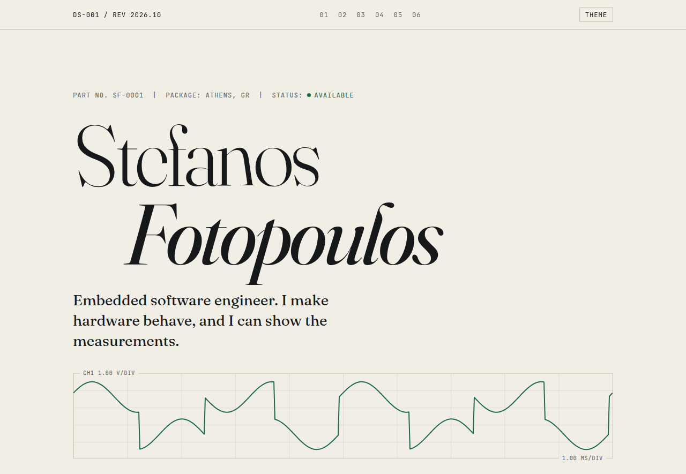
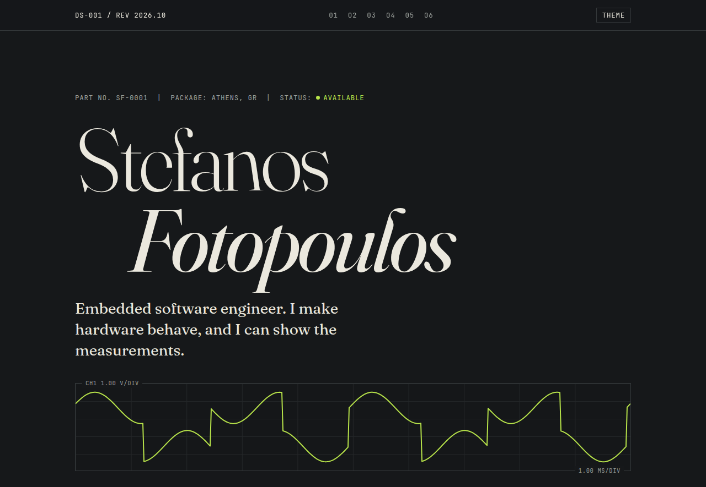
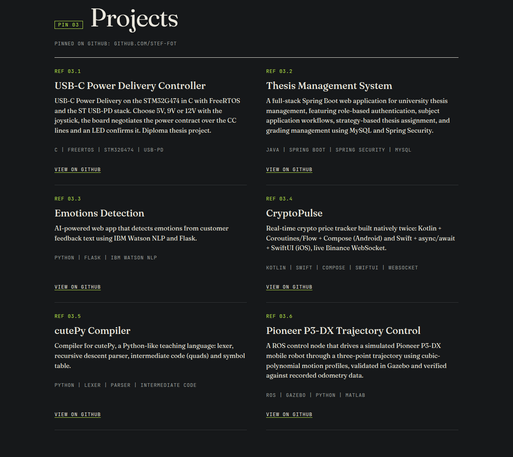
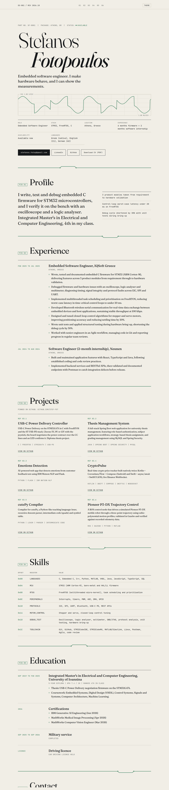
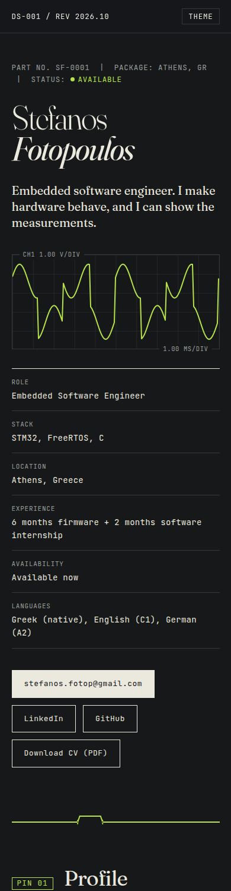

# Stefanos Fotopoulos, portfolio

Personal portfolio and CV as a website. The idea: a beautifully printed **datasheet** for an electronic component, where the component is me.

Static site (HTML, CSS, vanilla JavaScript). No build step, no dependencies.



## What you will find on the site

| Section | Contents | Who it is for |
|---|---|---|
| **Hero** | Name, one-line pitch, animated oscilloscope trace, fact sheet (role, stack, location, experience, availability, languages), buttons for email, LinkedIn, GitHub and CV | Recruiters: the essentials in 10 seconds |
| **PIN 01 Profile** | Short profile and three measurable results | Everyone |
| **PIN 02 Experience** | IQSoft Greece (Embedded Software Engineer) and Neunen (2-month internship), with concrete numbers | Engineering managers |
| **PIN 03 Projects** | A showcase of the 6 repositories pinned on GitHub, with their descriptions: USB-C Power Delivery (STM32G474), Thesis Management System, Emotions Detection, CryptoPulse, cutePy compiler, Pioneer P3-DX trajectory control | Technical reviewers |
| **PIN 04 Skills** | A register-map style table (offset, name, value) | Quick skim of the stack |
| **PIN 05 Education** | Integrated Master's at the University of Ioannina, certifications, military service, driving licence | Recruiters |
| **PIN 06 Contact** | Email, LinkedIn, GitHub, CV download | Everyone |

### Details that reward a closer look
- Every section is a **pin** of the datasheet, separated by a **PCB trace** (a line with solder pads).
- The hero has an **oscilloscope screen** with `CH1 1.00 V/DIV` and `1.00 MS/DIV` labels. The trace moves slowly and stops if the browser asks for reduced motion.
- `STATUS: AVAILABLE` carries a small LED-style indicator.
- Skills are written as register entries (`0x00 LANGUAGES`, `0x08 RTOS`).
- A print stylesheet turns the page into a clean one-document CV.

## Look and feel

Typography: **Fraunces** (a characterful serif) for headings and text, **JetBrains Mono** for labels and technical details. A single accent colour, used sparingly.

| Light (paper and solder-mask green) | Dark (graphite and scope yellow-green) |
|---|---|
|  |  |

The theme follows the system setting and switches with the `THEME` button at the top right.

### Projects showcase

The six repositories pinned on GitHub, each with its own description and a link.



### Full page and mobile

| Desktop | Mobile |
|---|---|
|  |  |

## Run it locally

No installation needed. Two options:

**1. Open the file.** Double-click `index.html`.

**2. Local server (recommended).** From the project folder:

```bash
python3 -m http.server 8000
```

then open http://localhost:8000. `npx serve` works too.

You only need internet for the fonts, which load from Google Fonts.

## Editing the content

All text lives in `index.html`, one section per `<section>`. Edit it directly. Replace `cv.pdf` with a newer export of the CV when needed.

## Structure

```
index.html   content
styles.css   themes, layout, print
main.js      theme toggle and oscilloscope trace
cv.pdf       downloadable CV
docs/        screenshots used in this README
.nojekyll    disables Jekyll on GitHub Pages
```

## Deploy (GitHub Pages)

Settings, Pages, Deploy from a branch, `main` and `/ (root)`. The site is served at `https://stef-fot.github.io/portfolio/`.
